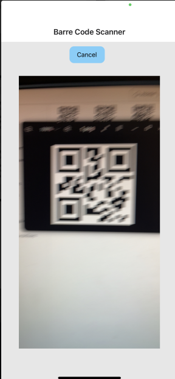

# Barcode Scanner

|       Nom       |  Prénom  |
|-----------------|----------|
|   ALONSO TORT   |  ANDONI  |

Application allowing the user to create a cart of items to purchase them thanks to a QR and bar code scanner system using stripe as the paying method.

## Required technologies

- [Android Studio](https://developer.android.com/studio "Android Studio") ainsi que la [JDK 20+](https://www.oracle.com/fr/java/technologies/downloads "JDK")
- [Docker](https://www.docker.com "Docker") Desktop ou CLI
- [NodeJS LTS](https://nodejs.org/fr "NodeJS")
- An [Stripe](https://stripe.com/fr "Stripe") account

## Project details

- [ ] Barcode scanner
    - [ ] Access to the cart
    - [ ] If the camera is not available, you must be able to add the articles manually
    - [ ] A check via the API is necessary to know if the article exists
- [ ] A products cart
    - [ ] Contains all scanned articles
    - [ ] Accessible from the article scan page
    - [ ] Possibility of removing a scanned item from the cart
    - [ ] Lorsque qu'un article est ajouté plusieurs fois, on affiche un indicateur précisant le nombre du même article
    - [ ] Ability to increase the quantity of an already scanned item
    - [ ] Pay for selected items using Stripe
    - [ ] Saving the cart for future purchases (using Sqlite)
- [ ] A history of paid items
- [ ] light/dark theme

The project is composed of the following things:

- [Server](./server/README.md) : An API developed with FastAPI to use Stripe. You can implement your own ( this code has been provided by my professor at the university, I just added the route '/checked/{customer_id}' in order to get the history)

- [Client](./client/README.md) : A starting React Native application, this is where yI developped the application

I used `Expo.SQLite` for data persistence

***It is important to configure the server before the client.***
==== SEE SERVER README FOR MORE INFORMATION =====
go to ./server/README.md

## Informations

The project was created using the following command:

```shell
npx create-expo-app -t expo-template-blank-typescript
```

==== SEE CLIENT README FOR MORE INFORMATION =====
go to ./client/README.md

PROJECT IMAGES AND DESCRIPTION

=== BARRE CODES ===

Les codes Qr et codes de barres se trouvent dans le dossier SCAN_CODES
avec 7 elements d'exemple.

=== MENU and Light/dark theme ====

Dans le menu principal veuillez de cliquer sur le cercle blanc/noir pour changer le thème de l'application

Light


Dark


=== HISTORY ====

Added a new server-side route to return a history of only items that are already checked
'/checked/{customer_id}' in desc order by date


==== SCANNER ====
When scanning, please place the camera directly in front of the barcode or QR code, the item
will be added automatically and you will be returned to your cart



=== NEW ====

Enter the item Id you wish to add, when you validate you will be returned to the cart page


=== ADD / REMOVE elements ====

In the cart, drag an item once and you will see two buttons:
	- Ajouter (+) // Add
	- Retirer (-) // Remove
The item will be deleted if quantity reaches 0

==== DELETE elements ====

If you want to directly delete the item without having to click "-" several times, you can drag the item twice
and the item will be deleter from your cart.


=== PAYER TEST ====

For the payment method you can test with a fake card ex: 42424242...


